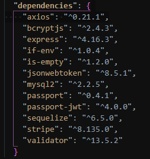
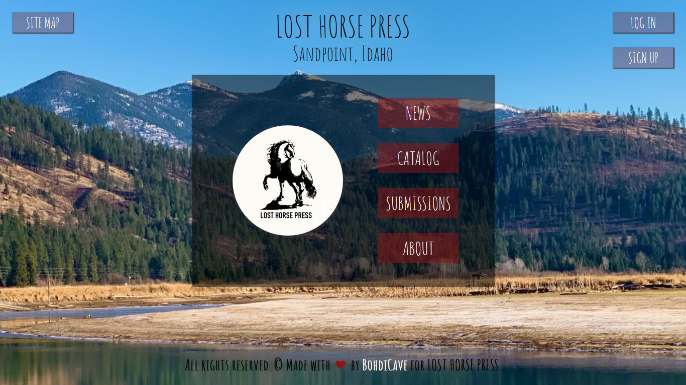

# Lost Horse Press

A full-stack MERN app using MySQL database with Sequelize, Node and Express on the backend, and React and Redux on the frontend.

## USER stories

AS A USER,
I WANT to visit this website,
ENJOY an aesthetically pleasant experience,
and FIND the information I’m interested in,
potentially PLACING AN ORDER.

AS A PUBLISHER,
I NEED to have an accessible website,
to POST updates (events, new releases)
and MANAGE my CATALOG and ORDERS without much trouble.

## Technologies Used

- BACKEND
  - Shorthand: MERN / MVC
  - Longhand:

    
  - Validation and authentication
    - bCrypt
    - Passport
    - JWT / Passport-JWT
    - Validator / if-empty
  - API routing - Axios
  - Server - Node / Express
  - Database - MySQL2 / Sequelize
  - Payments - Stripe (to be implemented)
- FRONTEND
  - Shorthand: React / Redux
  - Longhand:

    
  - API - again, Axios
  - Authentication - JWT-decode
  - React libraries:
    - Animations (for landing page)
    - Foundation (for CSS framework)
    - Icons / Styled components (for sitemap modal and styling)
  - Redux libraries:
    - Redux / React-redux
    - Middleware: Redux-thunk / Prop-types

## Screenshot - Before

## Screenshots - After

### Full responsiveness

## Links

- Current (old) website: [http://losthorsepress.org](http://losthorsepress.org)
- Deployed interim redevelopment project: [https://young-chamber-12240.herokuapp.com/](https://young-chamber-12240.herokuapp.com)
